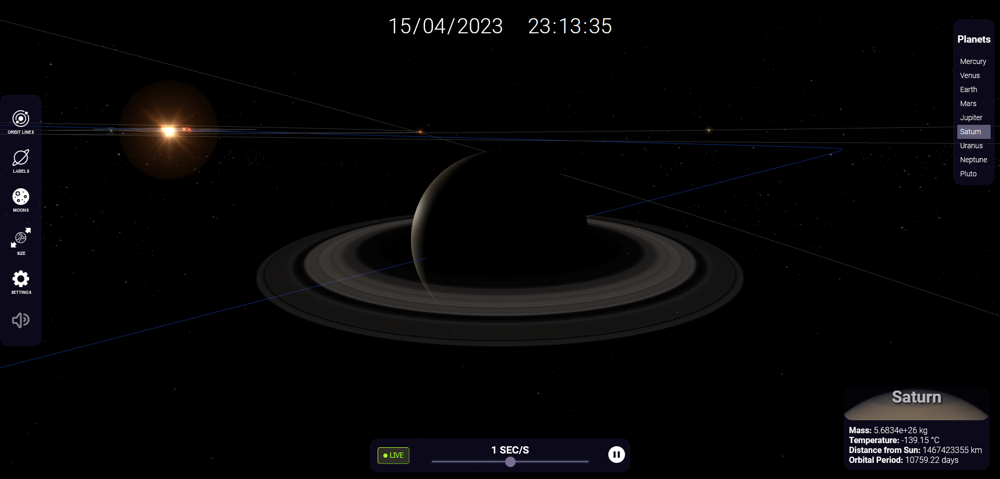

# Solar System



## Description

Solar System is an interactive web application that allows users to explore our solar system in 3D. Users can navigate around celestial objects such as planets and moons, and observe their trajectories. The application also provides detailed information about each celestial object and allows users to control the simulation speed.

[Demo](https://flmartineau.github.io/solar-system/)


## Features

- Realistic 3D representation of the solar system
- Smooth navigation and zooming around celestial objects
- Celestial objects trajectories displayed with orbit lines
- Detailed information about each celestial object
- Adjustable simulation speed
- Toggleable labels and orbit lines

## Installation

1. Clone this repository:

```git clone https://github.com/flmartineau/solar-system.git``` 

2. Install dependencies:

```npm install``` 

3. Start the development server:

```npm start```

4. Open your browser and navigate to `http://localhost:9000`.

## Deployment

To create a production build, run:

```npm run build```

The `dist` folder will be generated with the production-ready files. You can deploy this folder to your preferred hosting provider.

## Technologies

- Three.js
- TypeScript
- WebGL
- Webpack

## Credit

Background music by IvyMusic (https://pixabay.com/music/ambient-space-atmospheric-background-124841).
Planets images from NASA (https://solarsystem.nasa.gov).